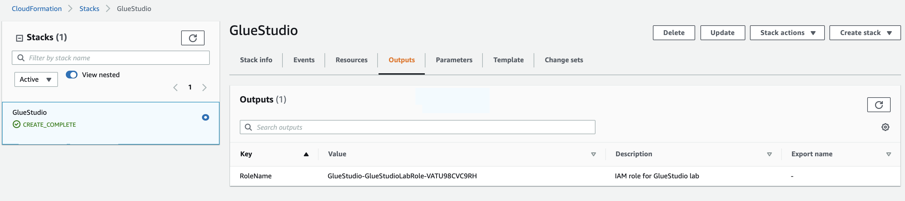

## AWS Glue Studio

**Introduction**

- AWS Glue studio is a GUI based interface that allows us to develop no code based ETL jobs which can be executed in AWS Glue. Thus abstracting the coding experience and accelerates the process for those who do. When the job is ready, you can run it and monitor the job status using the integrated UI

- AWS Glue Studio integrates with multiple types of data sources, ranging from structured and semi-structured, and provides data processing in real time and batch. 
It integrates with sources like Amazon S3, Amazon RDS, Amazon Kinesis, Apache Kafka and the output can be stored as external tables over Amazon S3 defined in the AWS Glue Data Catalog as destinations

**Tutorial**

- Step 1: Prerequisite  

  -  Download the <a href="https://github.com/sanchitdilipjain/aws-glue-studio/blob/main/dataset.csv">dataset</a> from this link and upload it to the S3 bucket
  
  -  Download the <a href="https://github.com/sanchitdilipjain/aws-glue-studio/blob/main/cloudformation.json">cloudformation template</a> from this link and Deploy it
  
  -  Once the Cloudformation stack is deployed successfully please capture the values for RoleName and S3Bucket details
      
       

- Step 2: Working with Glue Studio
  
  - In this section, we will be working with AWS Glue Studio and this section is divided into below parts    
     
     - Job creation process
     
     - Configure data & transform source node
     
     - Configure data target node
     
     - Review & Run 

   - Step 2.1: Job creation process

      1. Traverse to the <a href="https://console.aws.amazon.com/gluestudio/">AWS Glue Studio</a> and select View jobs

          
       
      2. Select Source and target added to the graph under Create job and click Create 
      
          
         
          
         
         Remove the apply mapping transformation by deleting it
         
          
     
   - Step 2.2: Configure data & transform source node
   
       1. Rename the job name, by clicking on the pencil icon at the left top

           
       
       2. Edit the data source node in the job graph and provide the S3 location where you upload the dataset downloaded under the prerequisite section
       
           
       
       3. Edit the schema under the data source node if data types are different
       
           
       
       4. Now we will edit the transform node of the job, please select a custom transform and copy paste the below function
         
          ```
          def MyTransform(glueContext, dfc) -> DynamicFrameCollection:
            selected = dfc.select(list(dfc.keys())[0]).toDF()

            from pyspark.sql.functions import regexp_replace as regxx

            modeCa = selected.groupby("ca").count().orderBy("count", ascending=False).first()[0]
            newDF = selected.withColumn('ca', regxx('ca', '\?', modeCa))

            modeThal = newDF.groupby("thal").count().orderBy("count", ascending=False).first()[0]
            newDF = newDF.withColumn('thal', regxx('thal', '\?', modeThal))

            results = DynamicFrame.fromDF(newDF, glueContext, "results")
            return DynamicFrameCollection({"results": results}, glueContext)
          ```
          
          
          
          The objective of the above function is to fill the missing values for the “Ca” column and “Thal” column. It is achieved by finding the mode of that column using pyspark sql functions
          
       5. Above changes will automatically create another transformation known as SelectFromCollection which can be used to select a dynamic frame from a dynamic frame collection
       
          
   
   - Step 2.3: Configure data target node 
   
        1. Edit the data target node in the job graph and provide the S3 location where you want the output to be persisted 

           
   
   - Step 2.4: Review & Run 
        
        1. Click on the script tab, below the job name and review the Spark code which is auto generated 

            
        
        2. Specify the job details and save the job
        
            
        
        3. Execute the job 
        
             
        
        4. Verify the output
